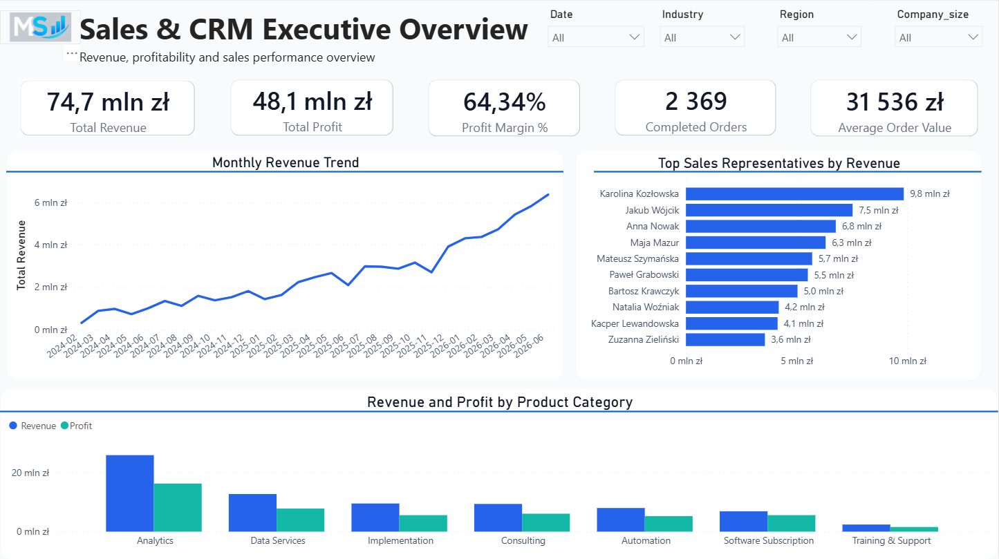
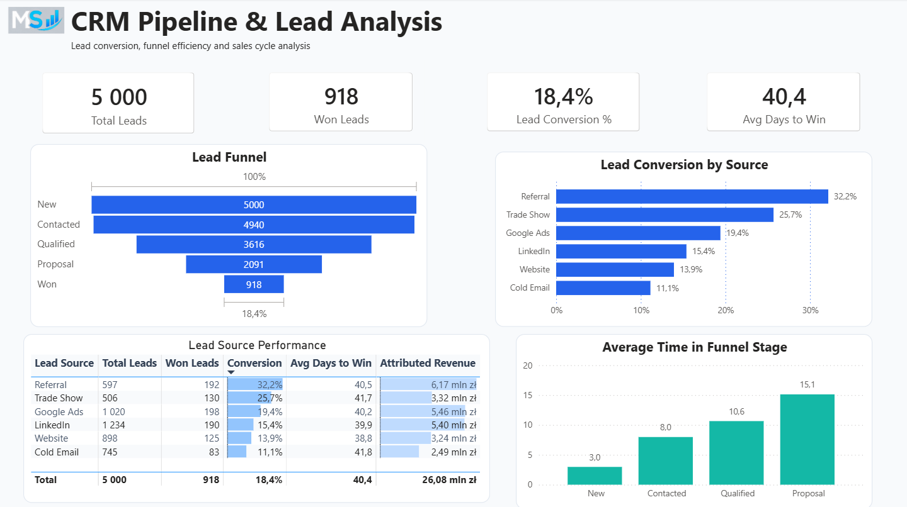
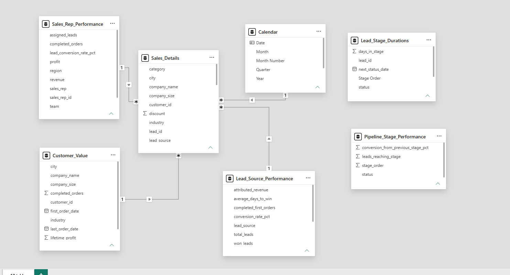
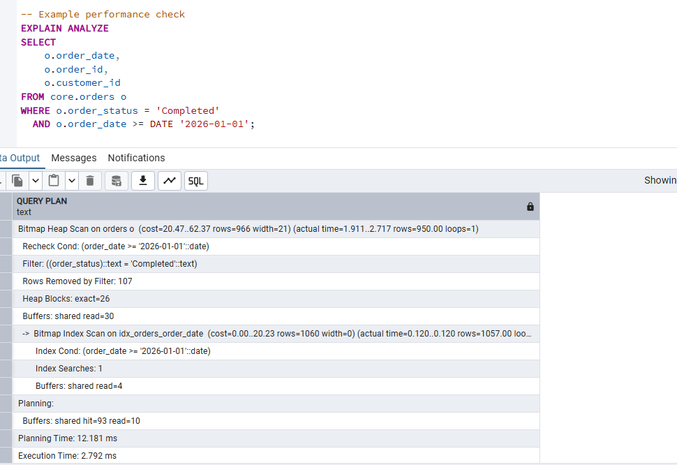
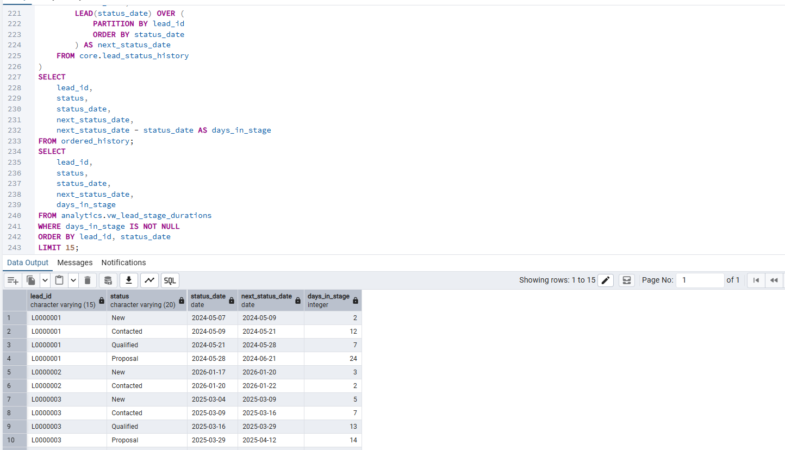

# Sales & CRM Analytics — PostgreSQL + Power BI

This is an end-to-end sales and CRM analytics project built with PostgreSQL and Power BI.

I wanted to go beyond creating a dashboard, so I built the project from raw data through cleaning, validation, SQL analysis and data modeling, all the way to the final Power BI report.

The dataset is synthetic and was created for portfolio purposes.

## Project overview

The project focuses on sales performance and CRM pipeline analysis.

The main questions I wanted to answer were:

- How much revenue and profit is being generated?
- Which sales representatives and product categories perform best?
- Which lead sources convert best?
- Where do leads drop out of the funnel?
- Which sales stages take the longest?
- Which customers generate the most value?

## Workflow

Raw CSV data → PostgreSQL staging → Data quality checks → Cleaning and validation → Core relational tables → Analytics views → Power BI

## Tools used

- PostgreSQL 18
- pgAdmin 4
- SQL
- Power BI Desktop
- Power Query
- DAX

## Database structure

I divided the PostgreSQL database into four schemas:

- `staging` — raw imported data
- `quality` — detected data quality issues
- `core` — cleaned and validated relational tables
- `analytics` — views prepared for reporting and Power BI

The core layer includes customers, sales representatives, products, leads, lead status history, orders and order items.

## Data quality work

The raw data contains realistic issues such as:

- duplicate IDs
- missing values
- invalid email addresses
- inconsistent text formatting
- broken relationships between tables
- invalid dates
- incorrect numeric values

I used SQL to identify and clean these issues before loading the data into the core layer.

I then ran validation queries to check primary keys, foreign key relationships and required fields before using the data for analysis.

## SQL workflow

The SQL part of the project is split into separate scripts:

01_create_schemas.sql
02_create_staging_tables.sql
03_create_core_tables.sql
04_data_audit.sql
05_clean_and_load.sql
06_data_validation.sql
07_basic_analysis.sql
08_advanced_analysis.sql
09_create_power_bi_views.sql
10_indexes_and_performance.sql

The analysis includes joins, CTEs, window functions, `LEAD()`, `LAG()`, `ROW_NUMBER()`, `DENSE_RANK()`, conditional aggregation, date calculations, funnel analysis, customer value analysis and profitability analysis.

I also added indexes to frequently used columns and checked query execution with `EXPLAIN ANALYZE`.

## Main results

### Executive KPIs

- Total Revenue: 74.7M PLN
- Total Profit: 48.1M PLN
- Profit Margin: 64.3%
- Completed Orders: 2 369
- Average Order Value: 31 536 PLN

### CRM funnel

- New: 5 000
- Contacted: 4 940
- Qualified: 3 616
- Proposal: 2 091
- Won: 918

Overall lead-to-win conversion: **18.4%**

### Lead source conversion

- Referral: 32.2%
- Trade Show: 25.7%
- Google Ads: 19.4%
- LinkedIn: 15.4%
- Website: 13.9%
- Cold Email: 11.1%

## Key insights

Referral is the strongest acquisition source in the dataset, with a conversion rate of 32.2%.

The Proposal stage is the longest part of the funnel, taking around 15 days on average.

Only 18.4% of all leads reach the Won stage.

The Analytics product category generates the highest revenue and profit in the dataset.

## Power BI report

### Executive Overview

### CRM Pipeline & Lead Analysis

## Power BI data model

## Advanced SQL example

The example below uses the `LEAD()` window function to calculate how long a lead stayed in each funnel stage.

## Query performance

`EXPLAIN ANALYZE` was used to check query execution and confirm index usage.

## Why I built this project

The goal was to show the full analytics workflow, not just the final dashboard.

The project covers data quality checks, cleaning, relational modeling, SQL analysis, performance optimization and Power BI reporting.

This is a portfolio project based on synthetic data.

## Author

MS Analytics

Data. Insights. Growth.
